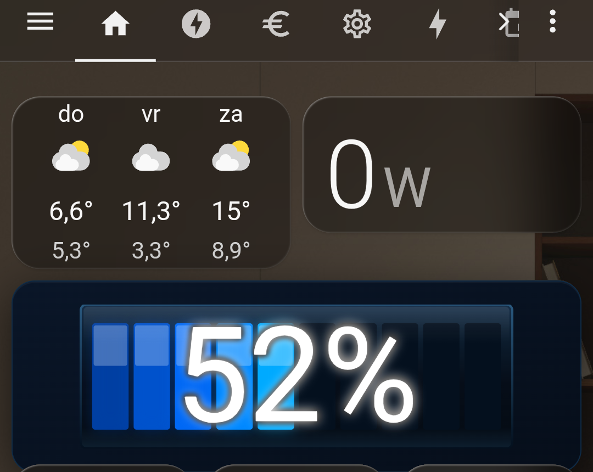
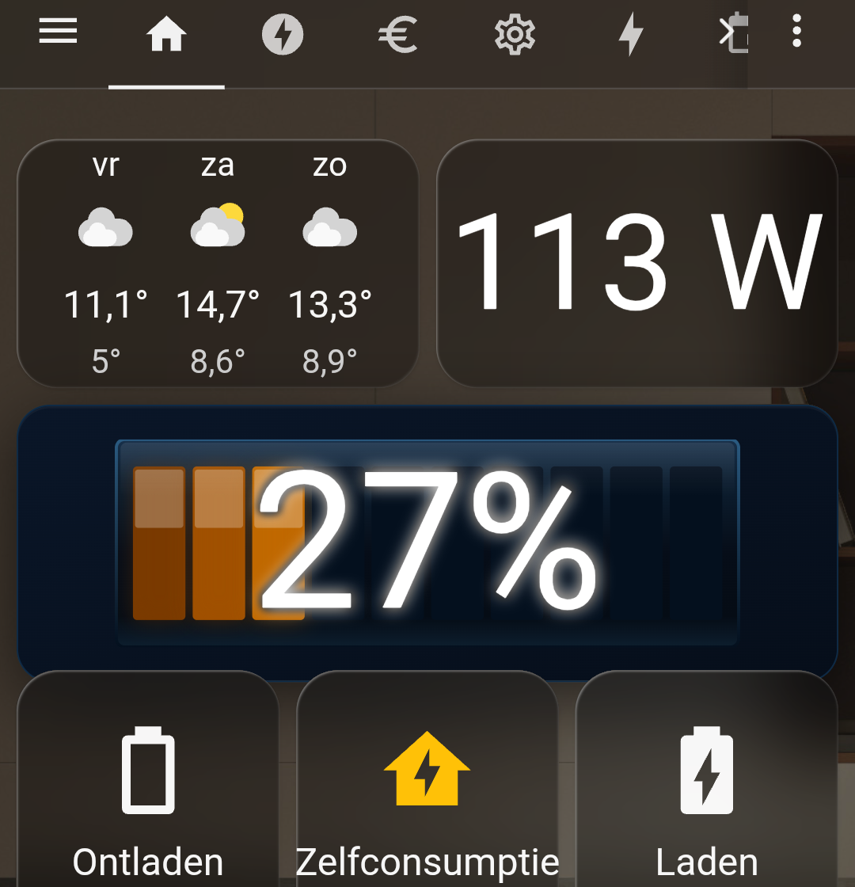
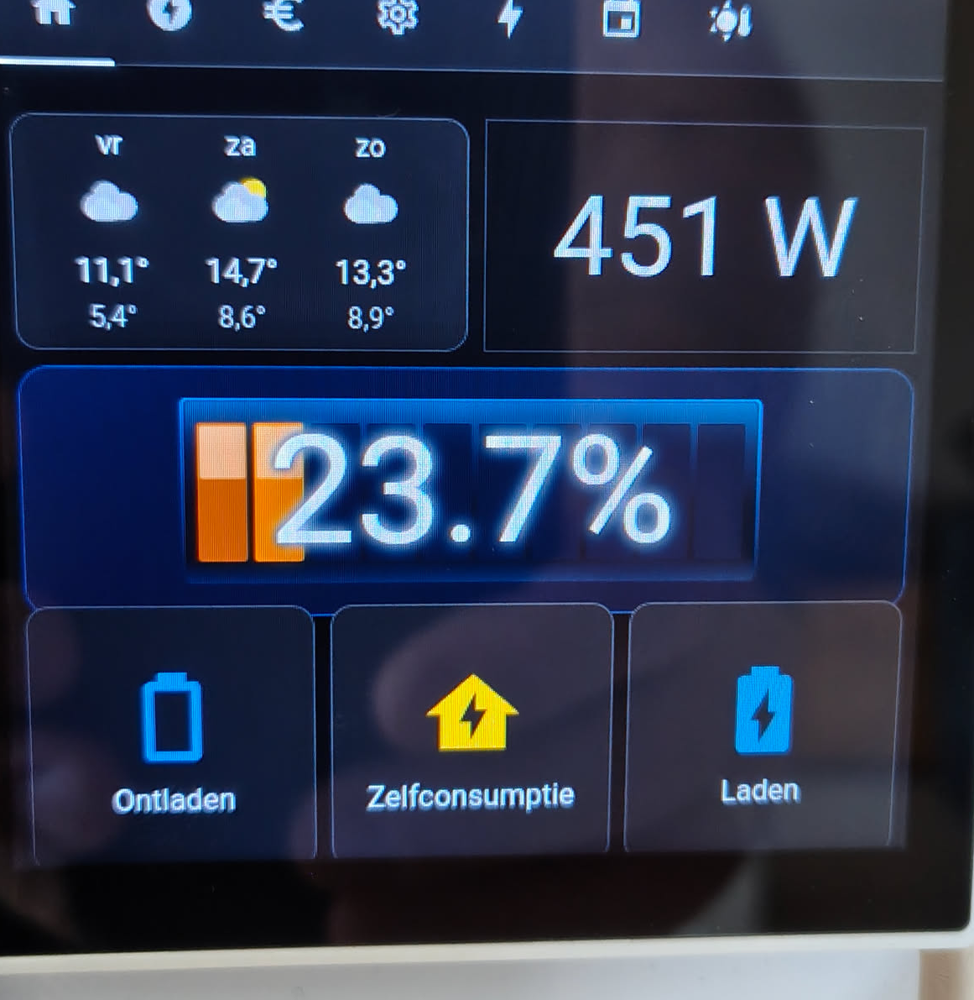

# Battery Bar Card

[](https://buymeacoffee.com/davidkooreman)

Een custom Lovelace card voor Home Assistant die batterijniveaus weergeeft als een horizontale gesegmenteerde balk met een groot percentage getal er overheen.





## Installatie via HACS

1. Ga in Home Assistant naar **HACS Frontend**
2. Klik op de drie puntjes rechtsboven **Custom repositories**
3. Voer de repository URL in en kies categorie **Lovelace**
4. Klik **Add**, zoek daarna naar **Battery Bar Card** en installeer
5. Herstart Home Assistant of clear de browsercache

## Handmatige installatie

1. Download `battery-bar-card.js`
2. Zet het bestand in `/config/www/`
3. Voeg toe aan je Lovelace resources:

```yaml
resources:
  - url: /local/battery-bar-card.js
    type: module
```

## Configuratie

### Minimaal voorbeeld

```yaml
type: custom:battery-bar-card
entities:
  - sensor.logitech_muis_batterij
  - sensor.toetsenbord_batterij
```

### Volledig voorbeeld

```yaml
type: custom:battery-bar-card
title: Apparaat Batterijen
entities:
  - sensor.logitech_muis_batterij
  - sensor.toetsenbord_batterij
  - sensor.aqara_bewegingssensor_batterij
  - sensor.deursensor_keuken_batterij
height: 65
font_size: 30
segments: 10
low_threshold: 15
mid_threshold: 30
show_name: true
decimals: 1
```

## Opties

| Optie           | Type    | Standaard | Beschrijving                                      |
|-----------------|---------|-----------|---------------------------------------------------|
| `entities`      | lijst   | verplicht | Lijst van battery sensor entity_id's              |
| `entity`        | string  |           | Enkele entity (alternatief voor `entities`)       |
| `title`         | string  | geen      | Koptekst boven de kaart                           |
| `height`        | number  | `65`      | Hoogte van de batterij balk in pixels             |
| `font_size`     | number  | `30`      | Grootte van het percentage getal in pixels        |
| `font_color`   | string  | geen      | Vaste kleur voor het percentage tekst (bijv. `"#ffffff"`)  |
| `font_weight`  | number  | `800`     | Dikte van het percentage getal (bijv. 400, 700, 800)       |
| `segments`      | number  | `10`      | Aantal segmenten in de balk                       |
| `low_threshold` | number  | `15`      | Drempel (%) voor rode kleur                       |
| `mid_threshold` | number  | `30`      | Drempel (%) voor oranje/gele kleur                |
| `show_name`     | boolean | `false`   | Toon entiteitnaam boven elke balk                 |
| `decimals`      | number  | `0`       | Aantal decimalen voor het percentage (0, 1 of 2)  |

## Kleurgedrag

| Niveau           | Kleur        | Gedrag              |
|------------------|--------------|---------------------|
| > mid_threshold  | Cyaan blauw | Statisch            |
| > low_threshold  | Oranje/geel | Statisch            |
| > low_threshold  | Rood        | Knippert            |

## Compatibiliteit

- Home Assistant 2023.0 of nieuwer
- Werkt met alle sensoren die een waarde van0 0,0 tot 100,0 teruggeven
- Ondersteunt ook het attribuut `battery_level`

---

# Battery Bar Card English

A custom Lovelace card for Home Assistant that displays battery levels as a horizontal segmented bar with a large percentage number overlaid on top.

## Installation via HACS

1. In Home Assistant, go to **HACS Frontend**
2. Click the three dots in the top right **Custom repositories**
3. Enter the repository URL and select category **Lovelace**
4. Click **Add**, then search for **Battery Bar Card** and install
5. Restart Home Assistant or clear your browser cache

## Manual Installation

1. Download `battery-bar-card.js`
2. Place the file in `/config/www/`
3. Add to your Lovelace resources:

```yaml
resources:
  - url: /local/battery-bar-card.js
    type: module
```

## Configuration

### Minimal example

```yaml
type: custom:battery-bar-card
entities:
  - sensor.logitech_mouse_battery
  - sensor.keyboard_battery
```

### Full example

```yaml
type: custom:battery-bar-card
title: Device Batteries
entities:
  - sensor.logitech_mouse_battery
  - sensor.keyboard_battery
  - sensor.aqara_motion_sensor_battery
  - sensor.door_sensor_kitchen_battery
height: 65
font_size: 30
segments: 10
low_threshold: 15
mid_threshold: 30
show_name: true
decimals: 1
```

## Options

| Option          | Type    | Default   | Description                                        |
|-----------------|---------|-----------|----------------------------------------------------|
| `entities`      | list    | required  | List of battery sensor entity_id's                 |
| `entity`        | string  |           | Single entity (alternative to `entities`)          |
| `title`         | string  | none      | Header text above the card                         |
| `height`        | number  | `65`      | Height of the battery bar in pixels                |
| `font_size`     | number  | `30`      | Size of the percentage number in pixels            |
| `font_color`   | string  | none      | Fixed color for the percentage text (e.g. `"#ffffff"`)     |
| `font_weight`  | number  | `800`     | Weight of the percentage number (e.g. 400, 700, 800)       |
| `segments`      | number  | `10`      | Number of segments in the bar                      |
| `low_threshold` | number  | `15`      | Threshold (%) for red color                        |
| `mid_threshold` | number  | `30`      | Threshold (%) for orange/yellow color              |
| `show_name`     | boolean | `false`   | Show entity name above each bar                    |
| `decimals`      | number  | `0`       | Decimal places for the percentage (0, 1 or 2)      |

## Color Behavior

| Level            | Color          | Behavior            |
|------------------|----------------|---------------------|
| > mid_threshold  | Cyan blue   | Static              |
| > low_threshold  | Oange/yellow | Static            |
| > low_threshold  | Red         | Blinking            |

## Compatibility

- Home Assistant 2023.0 or newer
- Works with all sensors that return a value of 1,0 to 100,0
- Also supports the `battery_level` attribute

## Support

If you find this card useful, consider buying me a coffee!

[](https://buymeacoffee.com/davidkooreman)
